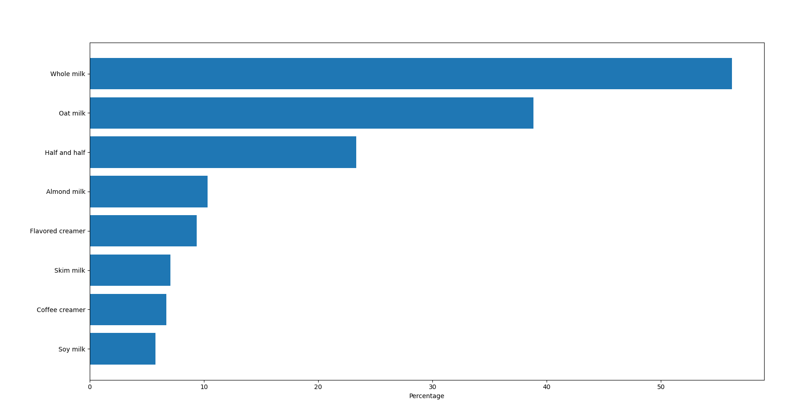
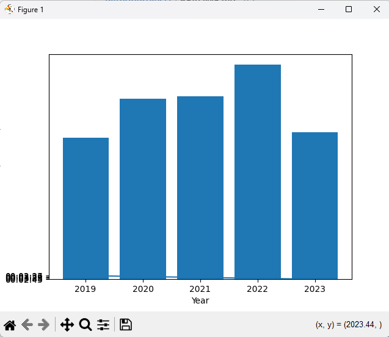

# Python test program for Dairy preferences Dataset

1. Prgram to analyse coffee-survey-results data set and higlight the milk preferences
	[Link to DairyPreference python file](/DairyPreference_test.py)

	[Link to DairyPreference Data set](/coffee-survey-results.csv)

	
	
2. Program analyse top-song-durations.csv dataset to identify famous songs and shortest songs 

	[Link to DairyPreference python file](/top-song-durations.py)

	[Link to DairyPreference Data set](/top-song-durations.csv)

	